# Improved CI/CD Workflow (Branch Protection Compatible)

This document explains the improved CI/CD workflow that works with manual review requirements and branch protection rules.

## 🎯 Overview

The improved workflow eliminates the need to commit generated types back to the main branch, avoiding branch protection conflicts while still maintaining full automation.

## 🔄 How It Works Now

### Previous Approach (Had Issues)

```mermaid
graph TD
    A[Deploy to Production] --> B[Generate Types]
    B --> C[Create PR with Types]
    C --> D[Auto-merge PR]
    D --> E[❌ BLOCKED by Branch Protection]
```



### New Improved Approach

```mermaid
graph TD
    A[Deploy to Production] --> B[Publish Types Workflow]
    B --> C[Generate Types from Production]
    C --> D[Version Bump & NPM Publish]
    D --> E[Create GitHub Release]
    E --> F[Create Notification Issue]
    F --> G[✅ Complete! No Branch Protection Issues]
```



## 📋 Workflow Steps

### 1. **CI Workflow** (`ci.yml`)

- Runs on every PR and push
- Tests code quality and database migrations
- Verifies types are up to date with local schema

### 2. **Deploy Workflow** (`deploy.yml`)

- Runs when code is merged to `main`
- Deploys database migrations to production
- Deploys Edge Functions (if any)
- ✅ **No longer generates types** (eliminated redundancy)

### 3. **Publish Types Workflow** (`publish-types.yml`)

- Triggers after successful deployment
- Generates types from **production database**
- Publishes directly to NPM
- Creates GitHub releases
- Creates notification issues
- ✅ **No commits back to main** (avoids branch protection)

## 🔧 Key Improvements

### ✅ Eliminated Redundancy

```diff
# deploy.yml
- Generate and verify production types
+ Simple deployment verification

# publish-types.yml
+ Single source of type generation
```

### ✅ Branch Protection Compatible

```diff
- Create Pull Request → Auto-merge → ❌ Blocked
+ Generate → Publish → Notify → ✅ Success
```

### ✅ Better Team Communication

- Creates GitHub issues to notify teams of new versions
- Clear changelog in GitHub releases
- NPM package immediately available

## 📱 Team Workflow

### For Backend Developers

```bash
1. Make schema changes
2. Create PR with migrations
3. PR gets reviewed and merged
4. ✅ Types automatically published to NPM
```

### For Frontend Teams

```bash
1. Get notification via GitHub issue
2. Update dependencies: npm update @everylanguage/shared-types
3. ✅ New types immediately available
```

## 🏷️ Version Management

### How Versions Are Determined

- **Patch (1.0.x)**: Bug fixes, performance improvements
- **Minor (1.x.0)**: New tables, non-breaking additions
- **Major (x.0.0)**: Breaking schema changes

### Commit Message Examples

```bash
feat: add audio_segments table        → Minor version
fix: add missing database index       → Patch version
feat!: restructure user_profiles      → Major version
```

## 🔔 Notifications

### GitHub Issues Created Automatically

When types are published, a GitHub issue is created with:

- 📦 New version number
- 🔗 NPM package link
- 📋 Installation instructions
- 🗂️ Next steps for teams

### Example Notification Issue

````markdown
📦 Types Package v1.2.0 Published

## 🎉 New TypeScript Types Published!

### 📋 Details

- Version: v1.2.0
- NPM Package: @everylanguage/shared-types@1.2.0
- Generated from: Production database schema

### 📱 For Application Teams

Update your dependencies:

```bash
npm update @everylanguage/shared-types
```
````

### 🗂️ Next Steps

- Types are ready to use immediately
- No manual merge required

````

## 🛠️ Manual Operations

### Manual Type Publishing
```bash
# Go to GitHub Actions → "Publish Types Package"
# Click "Run workflow"
# Choose version bump type (patch/minor/major)
# Click "Run workflow"
````

### Emergency Rollback

```bash
# Deprecate problematic version
npm deprecate @everylanguage/shared-types@1.2.3 "Use 1.2.2 instead"

# Publish hotfix
npm run version:patch
npm run prepare-package
npm publish
```

## 📊 Benefits of New Approach

### ✅ Compatibility

- Works with any branch protection settings
- No special permissions needed for main branch
- Compatible with manual review requirements

### ✅ Efficiency

- Eliminates redundant type generation
- Faster workflow execution
- Cleaner deployment process

### ✅ Communication

- Clear notifications to all teams
- Automatic issue creation for tracking
- Better version history and releases

### ✅ Reliability

- No branch protection conflicts
- Consistent versioning
- Automatic error handling

## 🔍 Monitoring

### Key Metrics to Watch

- ✅ Deploy workflow success rate
- ✅ NPM publish success rate
- ✅ GitHub release creation
- ✅ Issue notification creation

### Health Indicators

```bash
# Healthy pipeline shows:
✅ Deploy: All migrations applied successfully
✅ Publish: Package published to NPM
✅ Release: GitHub release created
✅ Notify: Team notification issue created
```

## 🚀 Next Steps

1. **Test the improved workflow**:

   ```bash
   # Make a test schema change
   # Create PR and merge to main
   # Watch workflows run automatically
   ```

2. **Monitor first run**:

   - Check Deploy workflow completion
   - Verify Publish Types workflow success
   - Confirm NPM package publication
   - Check GitHub issue creation

3. **Update team processes**:
   - Train teams on new notification system
   - Update documentation references
   - Set up monitoring dashboards

## 📚 Related Documentation

- [CI/CD Pipeline Overview](./ci-cd-pipeline.md)
- [Troubleshooting Guide](./ci-cd-troubleshooting.md)
- [NPM Package Setup](./npm-package-setup.md)
- [Schema Changes Guide](./schema-changes-guide.md)
