# CI/CD Pipeline Documentation

This document explains how our automated CI/CD pipeline works, what it does, and how to use it effectively.

## 📋 Overview

Our CI/CD pipeline consists of three main workflows:

1. **CI (Continuous Integration)** - Runs on every push and pull request
2. **Deploy** - Runs when code is merged to `main` branch
3. **Publish Types** - Automatically publishes NPM package when schema changes

## 🔄 CI Workflow (`ci.yml`)

### When It Runs

- Every push to `main` or `develop` branches
- Every pull request targeting `main` or `develop` branches
- Manually triggered from GitHub Actions tab

### What It Does

1. **Environment Setup**

   - Checks out your code
   - Sets up Node.js 18 with npm caching
   - Installs dependencies with `npm ci`

2. **Code Quality Checks**

   - **Linting**: Runs ESLint to check code style and catch errors
   - **Formatting**: Verifies Prettier formatting
   - **Type Checking**: Runs TypeScript compiler to catch type errors

3. **Database Testing**

   - Sets up Supabase CLI
   - Starts local Supabase instance
   - Waits for services to be ready
   - Runs all tests against local database

4. **Type Generation Verification**
   - Generates TypeScript types from current schema
   - Compares with committed types
   - Fails if types are out of date

### Example CI Run Output

```
✅ Checkout code
✅ Setup Node.js
✅ Install dependencies
✅ Run linting
✅ Check formatting
✅ Type check
✅ Setup Supabase CLI
✅ Start Supabase local development
✅ Wait for Supabase to be ready
✅ Run tests
✅ Verify generated types are up to date
✅ Stop Supabase
```

## 🚀 Deploy Workflow (`deploy.yml`)

### When It Runs

- Automatically when code is pushed to `main` branch
- Only after CI workflow passes
- Manually triggered from GitHub Actions tab

### What It Does

1. **Production Deployment**
   - Connects to production Supabase project
   - Applies database migrations
   - Deploys Edge Functions (if any exist)
   - Verifies production schema

## 📦 Publish Types Workflow (`publish-types.yml`)

### When It Runs

- Automatically after successful deployment to `main`
- Manually triggered from GitHub Actions tab with version options
- Only when database schema changes are detected

### What It Does

1. **Type Generation & Publishing**
   - Generates TypeScript types from production database
   - Compares with previously published types
   - Automatically bumps version (patch/minor/major)
   - Publishes `@everylanguage/shared-types` to NPM
   - Creates GitHub release with version notes
   - Updates repository with new types

### Version Bumping Logic

- **Major (x.0.0)**: Breaking changes detected in commit messages (`BREAKING CHANGE`, `feat!`)
- **Minor (1.x.0)**: New features detected (`feat:` commits)
- **Patch (1.0.x)**: Bug fixes and other changes

### Manual Publishing

You can manually trigger type publishing:

1. Go to Actions tab → "Publish Types Package"
2. Click "Run workflow"
3. Choose version bump type (patch/minor/major)
4. Click "Run workflow"

### Deployment Process

```mermaid
graph LR
    A[Code Merged to Main] --> B[Deploy Workflow Triggers]
    B --> C[Link to Production Supabase]
    C --> D[Apply Migrations]
    D --> E[Deploy Functions]
    E --> F[Verify Schema]
    F --> G[Deployment Complete]
    G --> H[Publish Types Workflow Triggers]
    H --> I[Generate Types from Production]
    I --> J[Check for Changes]
    J --> K[Bump Version & Publish to NPM]
    K --> L[Create GitHub Release]
```



## 🛠️ Developer Workflow

### Normal Development Process

1. **Create Feature Branch**

   ```bash
   git checkout main
   git pull origin main
   git checkout -b feature/your-feature
   ```

2. **Make Changes**

   ```bash
   # Make your changes
   # Add tests
   # Update documentation if needed
   ```

3. **Test Locally**

   ```bash
   npm test                    # Run tests
   npm run lint               # Check linting
   npm run format:check       # Check formatting
   npm run type-check         # Check types
   ```

4. **Commit and Push**

   ```bash
   git add .
   npm run commit             # Use conventional commits
   git push origin feature/your-feature
   ```

5. **Create Pull Request**

   - Go to GitHub and create PR
   - CI automatically runs
   - Wait for green checkmarks ✅
   - Request review from team

6. **Address CI Failures (if any)**

   ```bash
   # If linting fails:
   npm run lint:fix

   # If formatting fails:
   npm run format

   # If types are outdated:
   npm run generate-types

   # Commit fixes and push
   git add .
   git commit -m "fix: resolve CI issues"
   git push
   ```

7. **Merge After Approval**
   - All CI checks pass ✅
   - Code review approved ✅
   - Merge to main
   - Deploy workflow runs automatically

### Working with Database Changes

#### Creating Migrations

```bash
# Create new migration
supabase migration new add_user_profiles

# Edit the migration file
# supabase/migrations/20241201000001_add_user_profiles.sql

# Test migration locally
npm run migrate

# Generate updated types
npm run generate-types

# Commit changes (include both migration and types)
git add supabase/migrations/ types/database.ts
npm run commit
```

#### Migration Best Practices

1. **Always test migrations locally first**
2. **Include both up and down migrations**
3. **Generate types after schema changes**
4. **Test that CI passes before requesting review**
5. **Use conventional commits for proper version bumping**:
   - `feat:` for new tables/columns → Minor version bump
   - `fix:` for bug fixes → Patch version bump
   - `feat!:` or `BREAKING CHANGE:` → Major version bump

#### Schema Change Workflow

```bash
# 1. Create and test migration locally
supabase migration new your_change_name
# Edit migration file...
npm run migrate
npm run generate-types

# 2. Test locally
npm test

# 3. Commit with proper conventional commit
npm run commit
# Choose appropriate type (feat/fix/feat! for breaking)

# 4. Create PR and wait for CI
git push origin feature/your-change

# 5. After PR merge → Deploy runs → Types automatically published!
```

#### Post-Deployment: NPM Package

After your schema changes are deployed:

1. **Automatic Publishing**: Types package is automatically published to NPM
2. **Version Bumping**: Version is automatically determined from commit messages
3. **GitHub Release**: Automatically created with change notes
4. **Team Notification**: Other teams can update their dependencies

```bash
# In other repositories (React Native apps, web dashboards)
npm update @everylanguage/shared-types
```

## 🚨 Troubleshooting CI Failures

### Common Issues and Solutions

#### ❌ Linting Failures

```bash
# Error: ESLint found issues
npm run lint:fix           # Auto-fix most issues
npm run lint               # Check remaining issues
```

#### ❌ Formatting Failures

```bash
# Error: Code not properly formatted
npm run format             # Fix formatting
npm run format:check       # Verify formatting
```

#### ❌ Type Check Failures

```bash
# Error: TypeScript compilation failed
npm run type-check         # See detailed errors
# Fix the TypeScript errors in your code
```

#### ❌ Test Failures

```bash
# Error: Tests failed
npm test                   # Run tests locally
npm test -- --verbose      # Get detailed output
npm test -- tests/specific-test.test.ts  # Run specific test
```

#### ❌ Outdated Types Error

```bash
# Error: Generated types are out of date
npm run generate-types     # Regenerate types
git add types/database.ts  # Commit updated types
git commit -m "fix: update database types"
```

#### ❌ Supabase Connection Issues

This usually indicates:

- Migration syntax error
- Invalid SQL in migration
- Database connection timeout

```bash
# Debug locally:
supabase start
supabase status
# Check logs for errors
```

#### ❌ NPM Publishing Failures

```bash
# Error: NPM package publishing failed

# Check if NPM_TOKEN secret is configured correctly
# Verify package name is available on NPM registry
# Ensure version isn't already published
```

**Common NPM Issues:**

1. **Permission denied**: Check NPM_TOKEN secret
2. **Package name taken**: Update package name in package.json
3. **Version already exists**: Workflow will auto-bump, but manual bumps might conflict
4. **Network timeout**: Re-run workflow

#### ❌ Types Out of Sync

```bash
# Error: Types don't match production schema

# Manually sync types:
npm run generate-types
git add types/database.ts
git commit -m "fix: sync types with production schema"
git push

# Or trigger manual publishing:
# Go to Actions → Publish Types Package → Run workflow
```

## 🔐 Secrets Management

### Required Secrets

Set these in GitHub repository settings (Settings → Secrets and Variables → Actions):

```bash
SUPABASE_ACCESS_TOKEN=sbp_...     # Your Supabase access token
SUPABASE_PROJECT_REF=abcdef...    # Your production project reference
NPM_TOKEN=npm_...                 # Your NPM automation token
```

### How to Get These Values

1. **SUPABASE_ACCESS_TOKEN**:

   - Go to [Supabase Dashboard](https://app.supabase.com)
   - Click your profile → Access Tokens
   - Create new token with appropriate permissions

2. **SUPABASE_PROJECT_REF**:

   - Go to your project settings
   - Copy the Project Reference ID

3. **NPM_TOKEN**:
   - Go to [NPM website](https://www.npmjs.com) and login
   - Click your profile → Access Tokens
   - Generate new token with "Automation" type
   - Copy the token (starts with `npm_`)

### Local vs CI Environment

| Environment  | Local Development         | CI (GitHub Actions)        |
| ------------ | ------------------------- | -------------------------- |
| Supabase URL | `http://127.0.0.1:54321`  | `http://127.0.0.1:54321`   |
| Database     | Local Docker instance     | Fresh Docker instance      |
| Secrets      | `.env.local` file         | GitHub Secrets             |
| Data         | Persistent during session | Ephemeral (reset each run) |

## 📊 CI Status and Badges

### Understanding CI Status

| Status             | Meaning                   | Action Required           |
| ------------------ | ------------------------- | ------------------------- |
| ✅ **Success**     | All checks passed         | Ready to merge            |
| ❌ **Failed**      | One or more checks failed | Fix issues and push       |
| 🟡 **In Progress** | CI is currently running   | Wait for completion       |
| ⚪ **Pending**     | Waiting to start          | Wait for available runner |

### PR Status Checks

Your PR must pass these checks before merging:

- ✅ **lint-and-test** - All CI checks passed
- ✅ **Code review** - Approved by team member
- ✅ **Branch protection** - All requirements met

## 🔄 Advanced Workflows

### Manual Workflow Triggers

You can manually trigger workflows from GitHub:

1. Go to Actions tab
2. Select workflow (CI or Deploy)
3. Click "Run workflow"
4. Choose branch and click "Run workflow"

### Workflow Debugging

View detailed logs:

1. Go to Actions tab
2. Click on the workflow run
3. Click on job name (e.g., "lint-and-test")
4. Expand individual steps to see logs

### Re-running Failed Jobs

If CI fails due to temporary issues:

1. Go to the failed workflow run
2. Click "Re-run failed jobs"
3. Or "Re-run all jobs" to run everything again

## 📈 Best Practices

### For Developers

1. **Run checks locally before pushing**

   ```bash
   npm run lint && npm run format:check && npm run type-check && npm test
   ```

2. **Keep PRs small and focused**

   - Easier to review
   - Faster CI runs
   - Easier to debug failures

3. **Write meaningful commit messages**

   - Use conventional commits
   - Include context about changes

4. **Test database changes thoroughly**
   - Test migrations up and down
   - Verify types are updated
   - Test with realistic data

### For Teams

1. **Don't skip CI checks**

   - Never merge if CI is failing
   - Investigate failures promptly

2. **Review CI logs for failures**

   - Understand what went wrong
   - Learn from common issues

3. **Keep dependencies updated**
   - Regular npm audit
   - Update GitHub Actions versions

## 🆘 Getting Help

### When CI Fails

1. **Check the logs** in GitHub Actions
2. **Reproduce locally** using the same commands
3. **Ask team members** if you're stuck
4. **Create an issue** if it's a recurring problem

### Common Support Resources

- [GitHub Actions Documentation](https://docs.github.com/en/actions)
- [Supabase CLI Documentation](https://supabase.com/docs/guides/cli)
- [Jest Testing Documentation](https://jestjs.io/docs/getting-started)

## 📝 Pipeline Maintenance

### Regular Maintenance Tasks

- **Update GitHub Actions versions** monthly
- **Review and update Node.js version** quarterly
- **Audit and update npm dependencies** regularly
- **Review CI performance** and optimize if needed

### Monitoring Pipeline Health

Watch for:

- ⏱️ **Slow CI runs** (> 10 minutes)
- 📈 **High failure rates** (> 10%)
- 🔄 **Flaky tests** (intermittent failures)
- 💾 **Storage usage** (artifacts, caches)

This pipeline is designed to give you confidence in your deployments while maintaining development velocity. When in doubt, the CI system is your friend - it catches issues before they reach production!
