# Improved CI/CD Workflow (Branch Protection Compatible)

This document explains the improved CI/CD workflow that works with manual review requirements and branch protection rules.

## 🎯 Overview

The improved workflow eliminates the need to commit generated types back to the main branch, avoiding branch protection conflicts while still maintaining full automation.

## 🔄 How It Works Now

### New Improved Approach

```mermaid
graph TD
    A[Deploy to Production] --> B[Publish Types Workflow]
    B --> C[Generate Types from Production]
    C --> D[Version Bump & NPM Publish]
    D --> E[Create GitHub Release]
    E --> F[Create Notification Issue]
    F --> G[✅ Complete! No Branch Protection Issues]
```



## 📋 Workflow Steps

### 1. **CI Workflow** (`ci.yml`)

- Runs on every PR and push
- Tests code quality and database migrations
- Verifies types are up to date with local schema

### 2. **Deploy Workflow** (`deploy.yml`)

- Runs when code is merged to `main`
- Deploys database migrations to production
- Deploys Edge Functions (if any)
- ✅ **No longer generates types** (eliminated redundancy)

### 3. **Publish Types Workflow** (`publish-types.yml`)

- Triggers after successful deployment
- Generates types from **production database**
- Publishes directly to NPM
- Creates GitHub releases
- Creates notification issues
- ✅ **No commits back to main** (avoids branch protection)

## 📱 Team Workflow

### For Backend Developers

1. Make schema changes
2. Create PR with migrations
3. PR gets reviewed and merged
4. ✅ Types automatically published to NPM

### For Frontend Teams

1. Get notification via GitHub issue
2. Update dependencies: npm update @everylanguage/shared-types
3. ✅ New types immediately available

## 🏷️ Version Management

### How Versions Are Determined

- **Patch (1.0.x)**: Bug fixes, performance improvements
- **Minor (1.x.0)**: New tables, non-breaking additions
- **Major (x.0.0)**: Breaking schema changes

### Commit Message Examples

```bash
feat: add audio_segments table        → Minor version
fix: add missing database index       → Patch version
feat!: restructure user_profiles      → Major version
```

## 🔔 Notifications

### GitHub Issues Created Automatically

When types are published, a GitHub issue is created with:

- 📦 New version number
- 🔗 NPM package link
- 📋 Installation instructions
- 🗂️ Next steps for teams

## 🛠️ Manual Operations

### Manual Type Publishing

1. Go to GitHub Actions → "Publish Types Package"
2. Click "Run workflow"
3. Choose version bump type (patch/minor/major)
4. Click "Run workflow"

### Emergency Rollback

```bash
# Deprecate problematic version
npm deprecate @everylanguage/shared-types@1.2.3 "Use 1.2.2 instead"

# Publish hotfix
npm run version:patch
npm run prepare-package
npm publish
```
