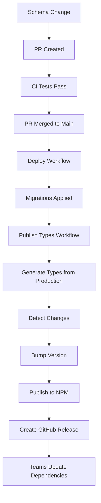

# NPM Package Setup Guide

This guide walks you through setting up automatic TypeScript types publishing for the `@everylanguage/shared-types` NPM package.

## 🎯 Overview

The setup enables automatic publishing of database types to NPM whenever schema changes are deployed. Other teams can then install and use these types across all applications.

## 📦 Package Configuration

The package is configured in `package.json` with these key settings:

```json
{
  "name": "@everylanguage/shared-types",
  "main": "types/database.js",
  "types": "types/database.d.ts",
  "exports": {
    ".": {
      "types": "./types/database.d.ts",
      "import": "./types/database.js"
    }
  },
  "files": ["types/database.d.ts", "types/database.js", "README.md"]
}
```

## 🚀 Quick Setup

### Step 1: Run Setup Script

```bash
# Validate configuration and prepare package structure
npm run setup-npm
```

This script will:

- ✅ Check all required files exist
- ✅ Validate package.json configuration
- ✅ Create types directory structure
- ✅ Test build process
- ✅ Check NPM authentication
- ✅ Verify package name availability

### Step 2: Generate Initial Types

```bash
# Make sure Supabase is running locally
npm run dev

# Generate types from your current schema
npm run generate-types

# Build the package
npm run prepare-package
```

### Step 3: Configure GitHub Secrets

Add these secrets to your GitHub repository (Settings → Secrets and Variables → Actions):

| Secret Name             | Description                  | How to Get                                                                            |
| ----------------------- | ---------------------------- | ------------------------------------------------------------------------------------- |
| `NPM_TOKEN`             | NPM automation token         | [NPM.com](https://www.npmjs.com) → Profile → Access Tokens → Create (Automation type) |
| `SUPABASE_ACCESS_TOKEN` | Supabase access token        | [Supabase Dashboard](https://app.supabase.com) → Profile → Access Tokens              |
| `SUPABASE_PROJECT_REF`  | Production project reference | Supabase Project → Settings → General → Reference ID                                  |

### Step 4: Test the Workflow

```bash
# Create a test schema change
supabase migration new test_npm_publishing

# Add a simple table to the migration
echo "CREATE TABLE test_table (id UUID PRIMARY KEY, name TEXT);" > supabase/migrations/*_test_npm_publishing.sql

# Test locally
npm run migrate
npm run generate-types

# Commit and push
git add .
npm run commit
# Select: feat -> "test NPM package publishing setup"
git push origin main
```

## 🔄 How It Works

### Automatic Publishing Flow



### Version Bumping Logic

The system automatically determines version bumps based on commit messages:

| Commit Message Pattern   | Version Bump      | Example                  |
| ------------------------ | ----------------- | ------------------------ |
| `feat: add new table`    | **Minor** (1.1.0) | New tables, columns      |
| `fix: add missing index` | **Patch** (1.0.1) | Bug fixes, optimizations |
| `feat!: breaking change` | **Major** (2.0.0) | Breaking schema changes  |

### Manual Publishing

You can also publish manually:

1. **Via GitHub Actions**:

   - Go to Actions → "Publish Types Package"
   - Click "Run workflow"
   - Choose version bump type
   - Click "Run workflow"

2. **Via Command Line** (for testing):
   ```bash
   npm run release
   ```

## 📱 Usage in Applications

### React Native Apps

```bash
# Install the types package
npm install @everylanguage/shared-types

# Update when new versions are published
npm update @everylanguage/shared-types
```

```typescript
import { Database } from '@everylanguage/shared-types';
import { createClient } from '@supabase/supabase-js';

const supabase = createClient<Database>(
  'your-supabase-url',
  'your-supabase-anon-key'
);

// Type-safe queries
const { data: recordings } = await supabase
  .from('recordings')
  .select('*')
  .eq('user_id', userId);
```

### Web Dashboards

```typescript
import { Database } from '@everylanguage/shared-types';

type ProjectData = Database['public']['Tables']['projects']['Row'];
type RecordingInsert = Database['public']['Tables']['recordings']['Insert'];

async function createProject(data: ProjectData) {
  // Implementation with full type safety
}
```

### Edge Functions

```typescript
import { Database } from '@everylanguage/shared-types';

export async function processAudio(
  recordingId: string
): Promise<Database['public']['Tables']['recordings']['Row']> {
  // Type-safe server-side implementation
}
```

## 🛠️ Troubleshooting

### Common Issues

#### ❌ NPM Token Invalid

```bash
# Error: npm ERR! code E401
# Error: npm ERR! 401 Unauthorized

# Solution: Check your NPM_TOKEN secret
# 1. Go to GitHub repository settings
# 2. Verify NPM_TOKEN secret exists and is correct
# 3. Generate new token if needed
```

#### ❌ Package Name Taken

```bash
# Error: npm ERR! 403 Forbidden

# Solution: Update package name
# 1. Change name in package.json
# 2. Update workflow files
# 3. Update documentation
```

#### ❌ Types Generation Failed

```bash
# Error: Cannot generate types from database

# Solution: Check Supabase connection
# 1. Verify SUPABASE_ACCESS_TOKEN
# 2. Verify SUPABASE_PROJECT_REF
# 3. Check if production database is accessible
```

#### ❌ Build Process Failed

```bash
# Error: TypeScript compilation failed

# Solution: Fix type issues
npm run type-check        # See detailed errors
npm run generate-types    # Regenerate types
npm run prepare-package   # Test build
```

### Debugging Steps

1. **Check GitHub Actions Logs**:

   - Go to Actions tab in GitHub
   - Click on failed workflow
   - Expand log sections to see errors

2. **Test Locally**:

   ```bash
   npm run setup-npm       # Validate configuration
   npm run generate-types  # Test type generation
   npm run prepare-package # Test build process
   ```

3. **Verify Secrets**:

   ```bash
   # In your local terminal, test NPM auth:
   npm whoami

   # Test Supabase connection:
   supabase projects list
   ```

## 📊 Monitoring

### Package Analytics

- **NPM Downloads**: Check [NPM package page](https://www.npmjs.com/package/@everylanguage/shared-types)
- **GitHub Releases**: See version history and changelogs
- **Workflow Runs**: Monitor CI/CD pipeline in Actions tab

### Version Tracking

Each published version includes:

- 🏷️ **GitHub Release** with changelog
- 📝 **Version tags** for tracking
- 📊 **Download statistics** on NPM
- 🔗 **Usage examples** in documentation

## 🔄 Maintenance

### Regular Tasks

- **Monthly**: Review version history and usage patterns
- **Quarterly**: Audit package dependencies and security
- **As Needed**: Update documentation and examples

### Updating Dependencies

```bash
# Update package dependencies
npm update

# Test everything still works
npm run setup-npm
npm test

# Commit updates
npm run commit
```

## 📚 Related Documentation

- [Schema Changes Guide](./schema-changes-guide.md) - Complete database workflow
- [CI/CD Pipeline](./ci-cd-pipeline.md) - Full pipeline documentation
- [GitHub Setup Guide](./github-setup-guide.md) - Initial repository setup
- [Development Setup](./development-setup.md) - Local development guide

## 🎉 Success!

Once setup is complete, your schema changes will automatically:

1. ✅ **Validate** through CI/CD
2. 🚀 **Deploy** to production
3. 📦 **Publish** types to NPM
4. 🏷️ **Tag** releases for tracking
5. 📢 **Notify** teams to update dependencies

Your teams can now enjoy type-safe development across all applications! 🚀
